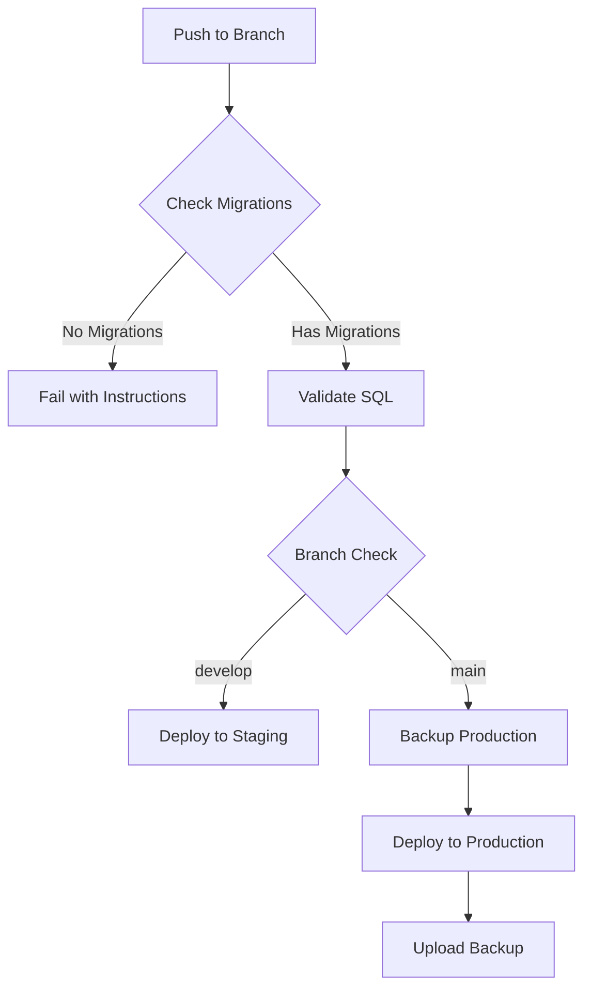

# Migration Guide

## Overview

This project uses an enhanced GitHub Actions workflow for stable database migrations with:
- ✅ Automatic migration validation
- ✅ Pre-deployment checks
- ✅ Production backups
- ✅ Rollback capabilities
- ✅ Environment protection

## Workflow Features

### 1. Automatic Checks
- **Migration Detection**: Checks if migration files exist
- **SQL Validation**: Basic syntax and safety checks
- **Environment Validation**: Ensures credentials are set

### 2. Safety Features
- **No Empty Deployments**: Fails if no migrations found
- **Production Backups**: Automatic backup before production deploy
- **Warning for Dangerous Operations**: Detects DROP/TRUNCATE statements

### 3. Environment Protection
- **Staging First**: Deploy to staging on `develop` branch
- **Production Deploy**: Deploy to production on `main` branch
- **Manual Approval**: Production deployments require environment approval

## Scripts Available

### 1. Pull Schema
```bash
./scripts/pull-staging-schema.sh
```
Pulls complete schema from staging database.

### 2. Validate Migrations
```bash
./scripts/validate-migrations.sh
```
Checks all migration files for:
- Empty files
- Missing semicolons
- Dangerous operations
- Naming conventions

### 3. Pre-Deploy Check
```bash
./scripts/pre-deploy-check.sh
```
Runs before pushing to ensure:
- Migrations exist
- Credentials are set
- Validations pass

### 4. Switch Environment
```bash
./scripts/switch-env.sh
```
Switch between staging/production environments.

### 5. Rollback
```bash
./scripts/migration-rollback.sh
```
Emergency rollback using backups.

## Typical Workflow

### First Time Setup
```bash
# 1. Pull existing schema from staging
./scripts/pull-staging-schema.sh

# 2. Validate migrations
./scripts/validate-migrations.sh

# 3. Commit migrations
git add supabase/migrations/
git commit -m "Add initial schema from staging"

# 4. Push to deploy
git push origin main  # Deploys to production
```

### Adding New Features
```bash
# 1. Create new migration
supabase migration new add_new_feature

# 2. Edit the migration file
# supabase/migrations/[timestamp]_add_new_feature.sql

# 3. Test locally
supabase db reset

# 4. Validate
./scripts/validate-migrations.sh

# 5. Pre-deploy check
./scripts/pre-deploy-check.sh

# 6. Deploy to staging first
git add .
git commit -m "Add new feature migration"
git push origin develop

# 7. After testing, deploy to production
git checkout main
git merge develop
git push origin main
```

## GitHub Actions Flow



## Environment Setup Required

### GitHub Secrets
```
SUPABASE_ACCESS_TOKEN
STAGING_PROJECT_REF = dijtowiohxvwdnvgprud
STAGING_DB_PASSWORD
PRODUCTION_PROJECT_REF = zutbqmhxvdgvcllobtxo
PRODUCTION_DB_PASSWORD
```

### Local .env.local
```bash
SUPABASE_ACCESS_TOKEN=your-token
STAGING_PROJECT_REF=dijtowiohxvwdnvgprud
STAGING_DB_PASSWORD=your-staging-password
PRODUCTION_PROJECT_REF=zutbqmhxvdgvcllobtxo
PRODUCTION_DB_PASSWORD=your-production-password
```

## Best Practices

1. **Always validate migrations** before pushing
2. **Deploy to staging first** and test thoroughly
3. **Review the diff** before production deployment
4. **Keep backups** of important schema changes
5. **Use transactions** in migrations when possible

## Troubleshooting

### No migrations deployed
- Check if `supabase/migrations/` directory exists
- Ensure migration files have `.sql` extension
- Check GitHub Actions logs for errors

### Migration failed
- Check SQL syntax in migration files
- Verify database credentials
- Look for conflicts with existing schema

### Need to rollback
- Use `./scripts/migration-rollback.sh`
- Or restore from GitHub Actions artifacts
- Contact Supabase support if needed